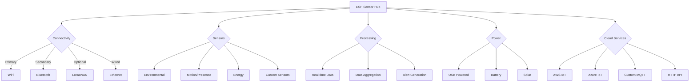
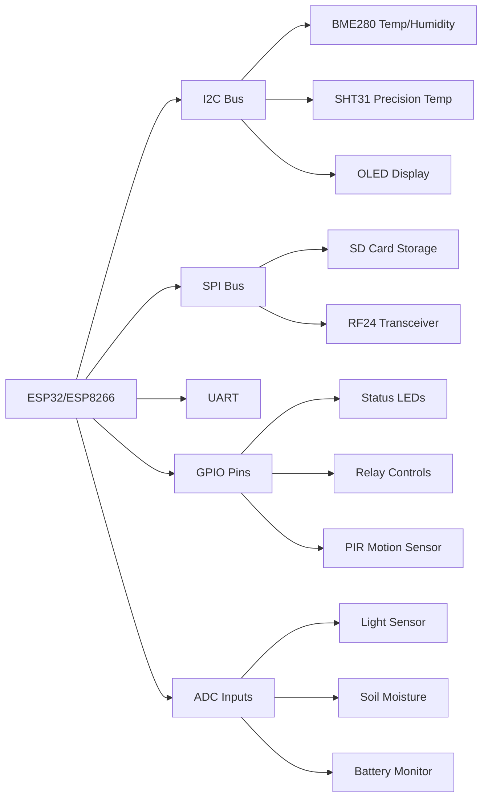
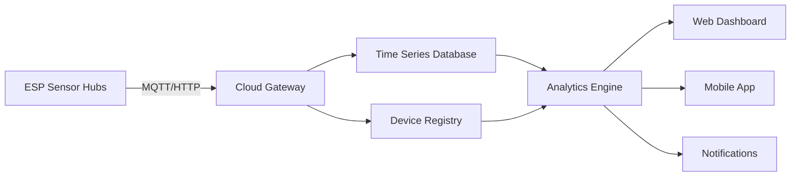

# ESP Sensor Hub: Production-Ready IoT Platform

A comprehensive, production-ready sensor hub platform built on ESP32/ESP8266 microcontrollers. This project demonstrates the seamless transition from prototype to production using Espressif hardware, with emphasis on reliability, scalability, and manufacturability.

## Overview

ESP Sensor Hub provides a complete reference implementation for IoT sensing applications that can be deployed in residential, commercial, and industrial settings. The platform showcases how ESP32/ESP8266 systems can bridge the prototype-to-production gap with minimal changes, enabling domestic manufacturing of IoT devices in Massachusetts.

## Features

- **Multiple Sensor Support**: Temperature, humidity, air quality, light, motion, and more
- **Flexible Connectivity**: WiFi, Bluetooth, BLE, optional LoRaWAN, and Ethernet
- **Cloud Integration**: Ready-made connections to AWS IoT, Azure IoT, and custom MQTT brokers
- **Local Processing**: Edge computing capabilities for real-time analysis and reduced bandwidth
- **Power Management**: Intelligent power modes for battery or solar operation
- **OTA Updates**: Secure over-the-air firmware updates
- **Production-Ready Design**: PCB layouts optimized for manufacturing
- **Enclosure Designs**: 3D-printable and injection-moldable enclosure options
- **Web-Based Installation**: Browser-based firmware installation without additional software

## System Architecture



## Hardware Diagram



## Production-Ready Features

This project is specifically designed to be manufacturing-friendly, with features that make the transition from prototype to production seamless:

1. **Modular Design**: Core components and sensors are modular for flexible manufacturing
2. **Manufacturable PCB**: 2-layer design with standard components and automated assembly compatibility
3. **Supply Chain Resilience**: Alternative component options for each sensor type
4. **Test Fixtures**: Custom testing jigs and automated test scripts for QA
5. **Packaging**: Designed for efficient packaging and shipping
6. **Regulatory Compliance**: FCC, CE, and UL certification guidelines
7. **Documentation**: Complete BOM, assembly instructions, and testing procedures

## Getting Started

### Installation Methods

#### 1. Web-Based Installation (Recommended)
The easiest way to install the firmware is directly from your web browser:

1. Go to [https://klawed.github.io/esp-sensor-hub/](https://klawed.github.io/esp-sensor-hub/)
2. Connect your ESP32/ESP8266 board to your computer
3. Click the "Install" button and follow the on-screen instructions
4. No additional software or drivers needed!

#### 2. Traditional Setup

##### Prerequisites
- Arduino IDE or PlatformIO
- ESP32 or ESP8266 development board
- Selected sensors from the supported list
- USB cable for programming

##### Steps
1. Clone this repository
   ```bash
   git clone https://github.com/klawed/esp-sensor-hub.git
   ```

2. Open the project in Arduino IDE or PlatformIO

3. Configure your hardware setup in `config.h`
   ```cpp
   // Choose your board type
   #define BOARD_ESP32       // or BOARD_ESP8266
   
   // Enable required sensors
   #define ENABLE_BME280     // Temperature/Humidity/Pressure
   #define ENABLE_SHT31      // Precision Temperature/Humidity
   #define ENABLE_CCS811     // Air Quality (TVOC/eCO2)
   ```

4. Configure your network settings in `network_config.h`
   ```cpp
   // WiFi credentials
   #define WIFI_SSID "your_ssid"
   #define WIFI_PASSWORD "your_password"
   
   // MQTT settings
   #define MQTT_SERVER "mqtt.example.com"
   #define MQTT_PORT 1883
   #define MQTT_USER "mqtt_user"
   #define MQTT_PASSWORD "mqtt_password"
   ```

5. Upload the firmware to your device

### Example Code

```cpp
#include "ESPSensorHub.h"

// Initialize sensor hub with device name
ESPSensorHub hub("living_room_hub");

void setup() {
  Serial.begin(115200);
  
  // Initialize the hub
  hub.begin();
  
  // Configure power saving mode
  hub.setPowerMode(POWER_MODE_BALANCED);
  
  // Set reporting interval (in seconds)
  hub.setReportInterval(300);  // 5 minutes
}

void loop() {
  // The hub handles everything automatically
  hub.update();
  
  // But you can also access sensor data directly
  if (hub.hasNewData()) {
    Serial.print("Temperature: ");
    Serial.print(hub.getTemperature());
    Serial.println(" °C");
    
    Serial.print("Humidity: ");
    Serial.print(hub.getHumidity());
    Serial.println(" %");
    
    // Trigger any custom actions based on sensor data
    if (hub.getTemperature() > 30) {
      // High temperature alert
      hub.triggerAlert("high_temperature");
    }
  }
  
  // Power-efficient delay
  hub.sleep();
}
```

## Production Manufacturing Files

The `/manufacturing` directory contains all files needed for production:

- Gerber files for PCB manufacturing
- BOM (Bill of Materials) in CSV format
- Assembly instructions and diagrams
- Test procedures and acceptance criteria
- Enclosure STL files for 3D printing or injection molding

## Scaling to Production

This project is specifically designed to scale from a single prototype to mass production with minimal changes:

1. **Prototype**: Use the development board and breadboard setup
2. **Small Batch**: Assemble the custom PCB by hand (10-50 units)
3. **Medium Scale**: Use PCB assembly service (50-500 units)
4. **Large Scale**: Full-scale manufacturing with automated testing (500+ units)

All design files include the necessary specifications for each stage of scaling.

## Cloud Dashboard

The ESP Sensor Hub connects to a customizable web dashboard for monitoring and control:



## Power Consumption Analysis

| Mode | ESP32 (mA) | ESP8266 (mA) | Battery Life (2000mAh) |
|------|------------|--------------|------------------------|
| Active | 120-260 | 80-170 | 8-25 hours |
| Light Sleep | 0.8-1.0 | 0.5-0.9 | 3-4 months |
| Deep Sleep | 0.01-0.06 | 0.02-0.05 | 3-5 years |
| Optimized* | 0.15-0.3 | 0.1-0.2 | 1-2 years |

*Optimized mode uses deep sleep with periodic wake-ups to check sensors and report data

## Contributing

Contributions are welcome! Please feel free to submit a Pull Request.

## License

This project is licensed under the MIT License - see the LICENSE file for details.

## Acknowledgements

- Espressif Systems for the excellent ESP32 and ESP8266 platforms
- All the open source libraries that make this project possible
- The maker community for inspiration and support